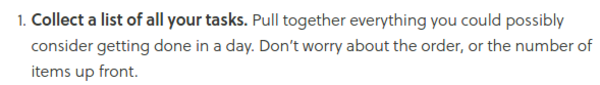
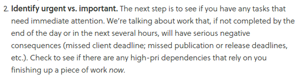
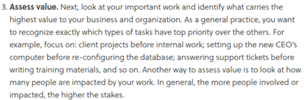
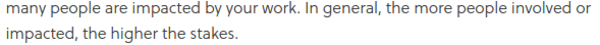
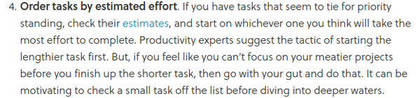
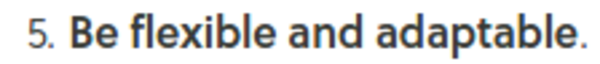
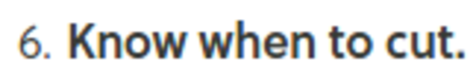
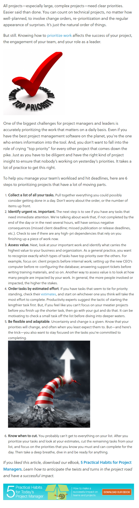

* First I need to collect all tasks that I want to do within a day.
* Just brainstorm all task first!

* Identify the importance and the urgency for each tasks.
* Urgent means that it need to be done as soon as possible.
* Importance means that it must be done under certain deadline but not for today.

* Asses each task's value.
* Value assessment is done by counting how many people are attached to the task.
* More people attached to the task the bigger assessment value for that task.

* Estimate ow much energy and time you would need to done that task.
* Here is the thing! Start days with the longest task first. If I cannot focus then start with the smalled task.
* It can also work the other way around, by doing small task to motivate me to do bigger task.

* Be flexible!
* This is for switching over task and not necessarily to finish task in one go.

* Know where you should stop to add tasks.
* Sometimes doing 10 to 20 to dos are enough per day.
* Or depend on my need to take a breath and do something fun.
* However, keep in mind that I need to respect the importance and the urgency list first!
* Here is the link to full article, [https://www.liquidplanner.com/blog/how-to-prioritize-work-when-everythings-1/](https://www.liquidplanner.com/blog/how-to-prioritize-work-when-everythings-1/).
* Here is the full screenshot.

