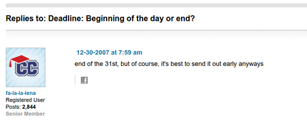

* If the deadline day is, for example, listed as 31th August 2016.
* It means that the last time to submit the corresponding matter(s) will be in the late night of 31st August 2016 just before 1st September 2016.
* I was wondering if deadline actually means the time when date goes to deadline date. But apparently, based on information that I found here, [http://talk.collegeconfidential.com/college-admissions/441348-deadline-beginning-of-the-day-or-end.html](http://talk.collegeconfidential.com/college-admissions/441348-deadline-beginning-of-the-day-or-end.html), deadline means the time when the date goes to a day after the deadline day.

