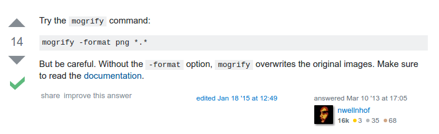

* Here ImageMagick command to convert multiple images from different format into another format. For example if I have a folder full of .jpeg, .jpg, and .png and I want to convert these to .png format.

```markdown
mogrify -format png *.*
```
* Change the `png` into other image format as you choose.
* I know these from this StackOverflow discussion, [http://stackoverflow.com/questions/15315770/how-to-convert-all-files-in-different-formats-in-given-folder-to-different-fil](http://stackoverflow.com/questions/15315770/how-to-convert-all-files-in-different-formats-in-given-folder-to-different-fil).
* Here is the screenshot.

