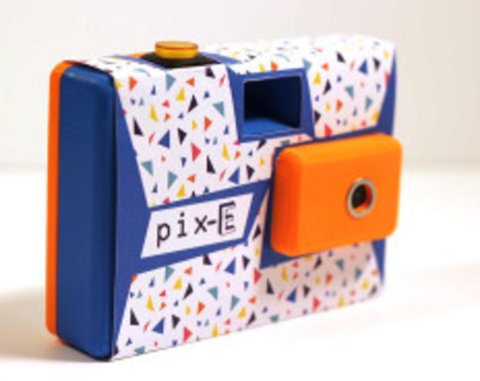
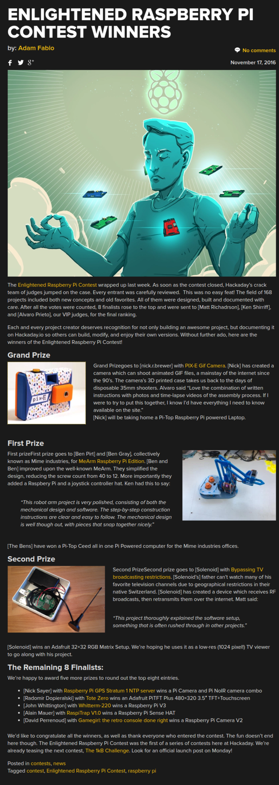

* Raspberry PI Hackday contest winner, [http://hackaday.com/2016/11/17/enlightened-raspberry-pi-contest-winners/](http://hackaday.com/2016/11/17/enlightened-raspberry-pi-contest-winners/).

* There is a Raspberry PI based .gif camera that gets my attention, [https://hackaday.io/project/16358-pix-e-gif-camera](https://hackaday.io/project/16358-pix-e-gif-camera).
* Full article.

