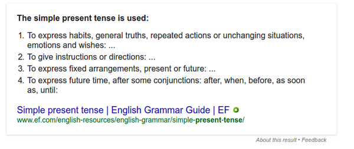
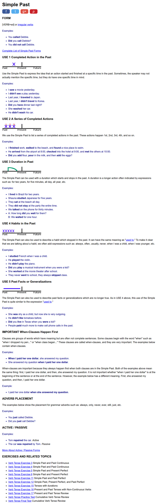
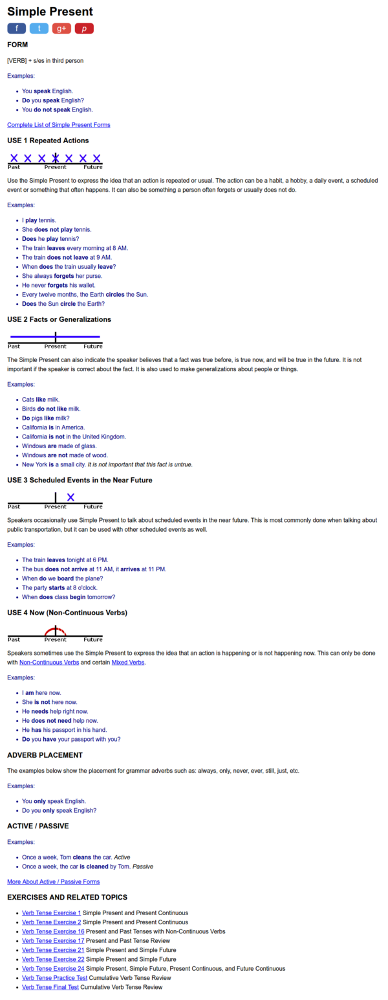

* The screenshot is from Google search.
* Basically simple present is used for these.
    * Habit.
    * To give instruction.
    * To express arrangement in present or in the future.
    * To express future time.
* Simple past is used in these situations.
    * Completed action in the past.
    * Series of completed action in the past.
    * Duration in the past. For example, "I lived in Brazil for 2 years.".
    * Past habit.
    * Past fact or generalization that happen in the past.
* There is also "when clauses happen first", but this is not so relevant for me now.
* Below are article that explains the usage of simple past, [http://www.englishpage.com/verbpage/simplepast.html](http://www.englishpage.com/verbpage/simplepast.html).
* Below is the full screenshot.

* Simple present is used in these situations.
    * Repeated actions.
    * Facts or generalizations.
    * Scheduled event in the near future.
    * Thing that happen now.
* There is also information about adverb placement.
* Below is an article that shows the usage of simple present, [http://www.englishpage.com/verbpage/simplepresent.html](http://www.englishpage.com/verbpage/simplepresent.html).
* Below is the full screenshot.

