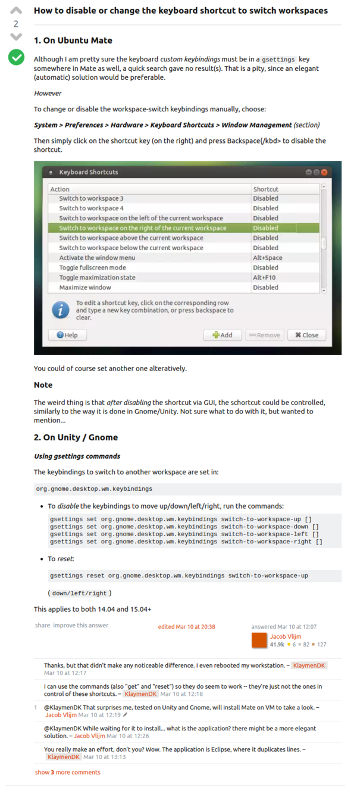

* Here is a discussion on how to delete/disable keyboard shortcut in Ubuntu based distribution. [http://askubuntu.com/questions/744214/how-to-disable-the-keyboard-shortcut-to-switch-between-workspaces](http://askubuntu.com/questions/744214/how-to-disable-the-keyboard-shortcut-to-switch-between-workspaces).
* For me, since I am using Ubuntu MATE, what I need to do is to open Keyboard Shortcut application, refer to the keyboard shortcut that I want to delete. Click on the right column (button configuration) and then press Backspace.

