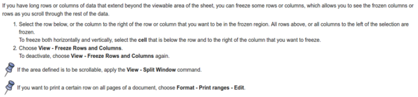

* How to get fixed header in LibreOffice Calc (freezing column(s) or row(s), [https://help.libreoffice.org/Calc/Freezing_Rows_or_Columns_as_Headers](https://help.libreoffice.org/Calc/Freezing_Rows_or_Columns_as_Headers).

