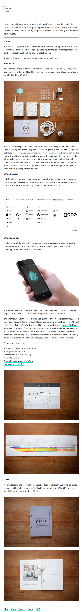

* Alternet is a proposal of telecommunication network where people can control all data license.
* I think this is like Android application request permission in case the application want to request physical interface of the Android device.
* Here is the homepage of Alternet, [https://sarah.gold/work.html](https://sarah.gold/work.html).
* Here is link to the Vimeo video of Alternet, [https://vimeo.com/134718366](https://vimeo.com/134718366).
* Here is the screenshot of the article.

