* These are the articles. There are a lot f sub - articles as well.    
    * [http://arstechnica.com/information-technology/2014/02/how-to-run-your-own-e-mail-server-with-your-own-domain-part-1/](http://arstechnica.com/information-technology/2014/02/how-to-run-your-own-e-mail-server-with-your-own-domain-part-1/)
    * [http://arstechnica.com/information-technology/2014/03/taking-e-mail-back-part-2-arming-your-server-with-postfix-dovecot/](http://arstechnica.com/information-technology/2014/03/taking-e-mail-back-part-2-arming-your-server-with-postfix-dovecot/)
    * [http://arstechnica.com/business/2014/03/taking-e-mail-back-part-3-fortifying-your-box-against-spammers/](http://arstechnica.com/business/2014/03/taking-e-mail-back-part-3-fortifying-your-box-against-spammers/)
    * [http://arstechnica.com/information-technology/2014/04/taking-e-mail-back-part-4-the-finale-with-webmail-everything-after/](http://arstechnica.com/information-technology/2014/04/taking-e-mail-back-part-4-the-finale-with-webmail-everything-after/)
* These are the article screenshots.

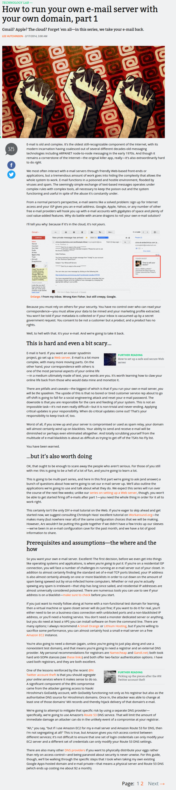

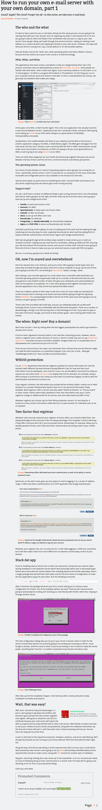

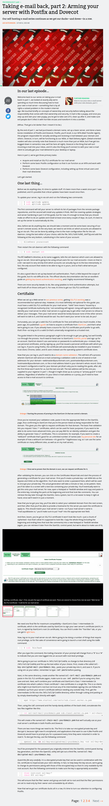

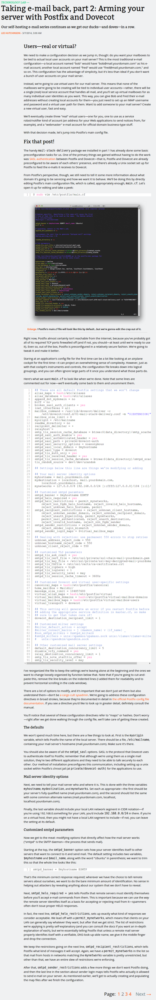

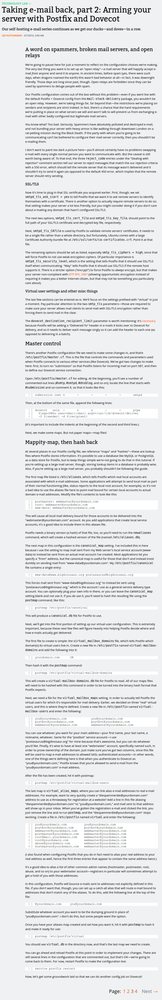

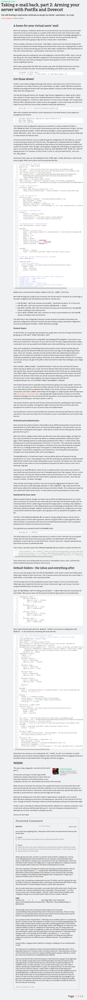

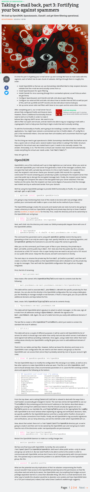

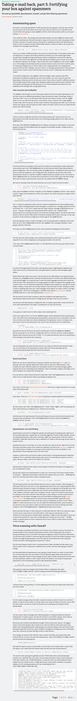

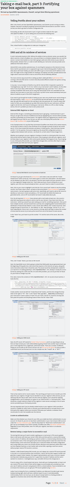

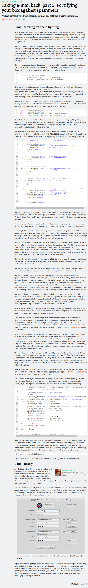

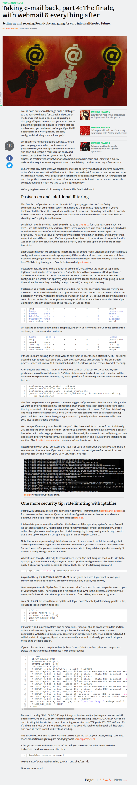

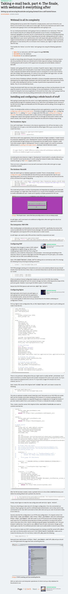

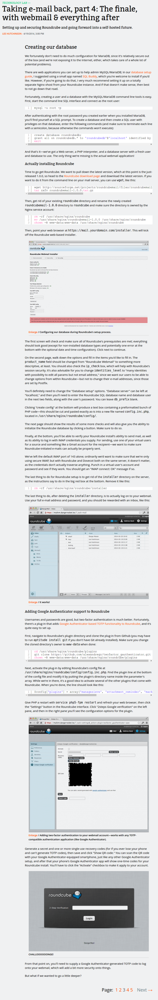

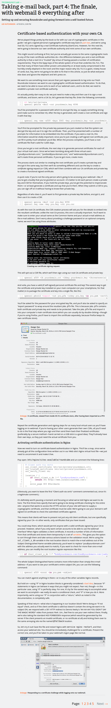

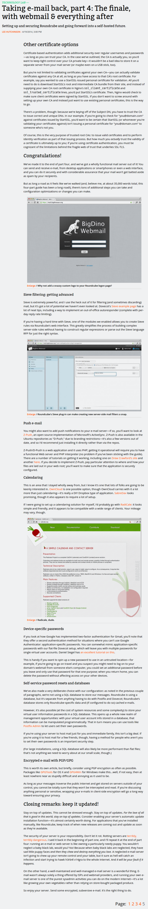