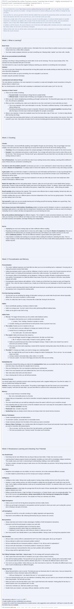

* There is this post in Reddit on how to learn to learn, [https://www.reddit.com/r/GetMotivated/comments/5950tm/text_i_just_finished_the_online_coursera_course/](https://www.reddit.com/r/GetMotivated/comments/5950tm/text_i_just_finished_the_online_coursera_course/).
* This topic definitely caught my attention due to I am also want to know the most efficient way on how to learn something new fast.
* The thread has a lot of upvotes so I thought I might as well join the course here, [https://www.coursera.org/learn/learning-how-to-learn/](https://www.coursera.org/learn/learning-how-to-learn/).
* Here is the full screenshot of the article.

