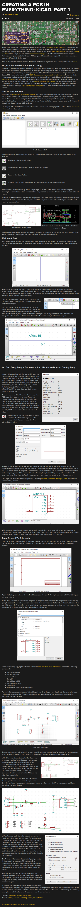

* Hackaday KiCAD tutorial, [http://hackaday.com/2016/11/17/creating-a-pcb-in-everything-kicad-part-1/](http://hackaday.com/2016/11/17/creating-a-pcb-in-everything-kicad-part-1/).
* There is no part 2, albeit this tutorial says part 1.
* There is this official KiCAD tutorials as well, [http://kicad-pcb.org/help/tutorials/](http://kicad-pcb.org/help/tutorials/).
* Here is the screenshot of Hackaday KiCAD tutorial.

