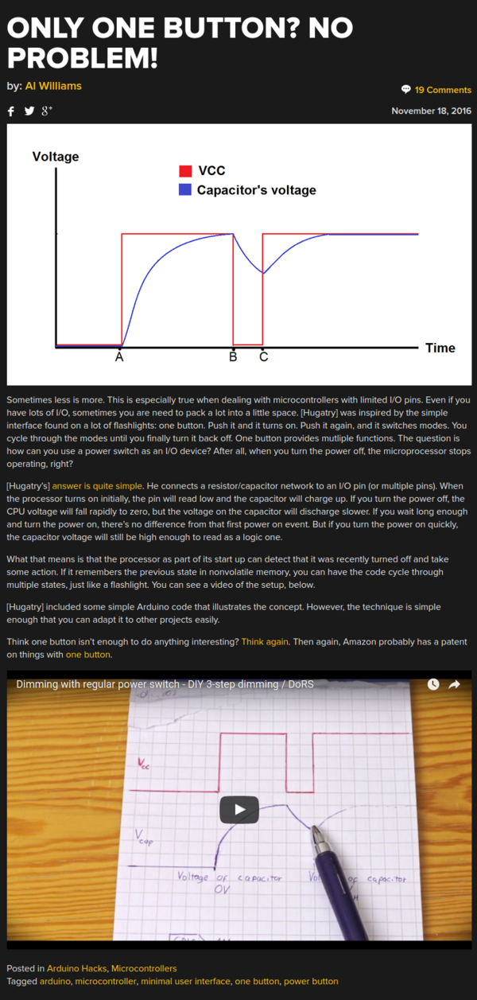

* There is this article in Hackaday that shows on how to have a GPIO to have multiple functionalities.
* For example, the case here would be that a button can have 2 or more function instead of just one.
* Here is the link to the article, [http://hackaday.com/2016/11/18/only-one-button-no-problem/](http://hackaday.com/2016/11/18/only-one-button-no-problem/).
* Here is the link to the YouTube video, [https://www.youtube.com/watch?v=67rrjdR3EmI](https://www.youtube.com/watch?v=67rrjdR3EmI).
* Here is the screenshot of the article.

