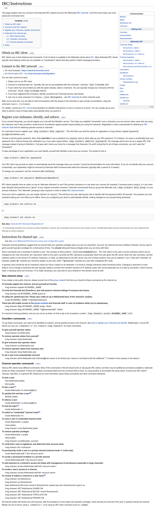

* Command to change password in IRC channel, `/msg nickserv set password "newPassword"`.
* Command to login in IRC channel, `/msg nickserv identify "password"`.
* This web page contains some of basic IRC command, [https://meta.wikimedia.org/wiki/IRC/Instructions](https://meta.wikimedia.org/wiki/IRC/Instructions).
* This is the screenshot.

