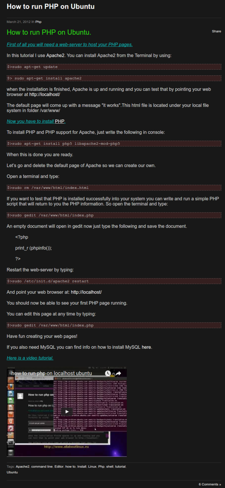
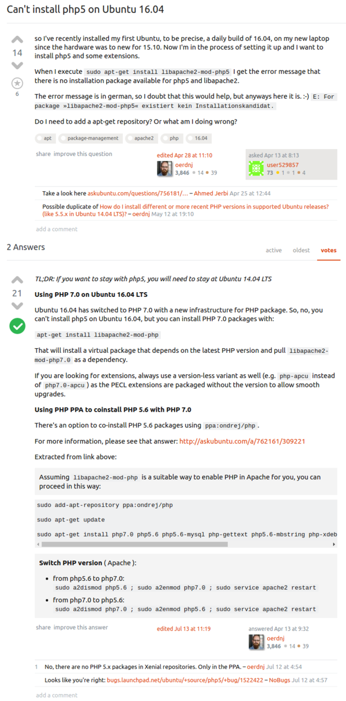
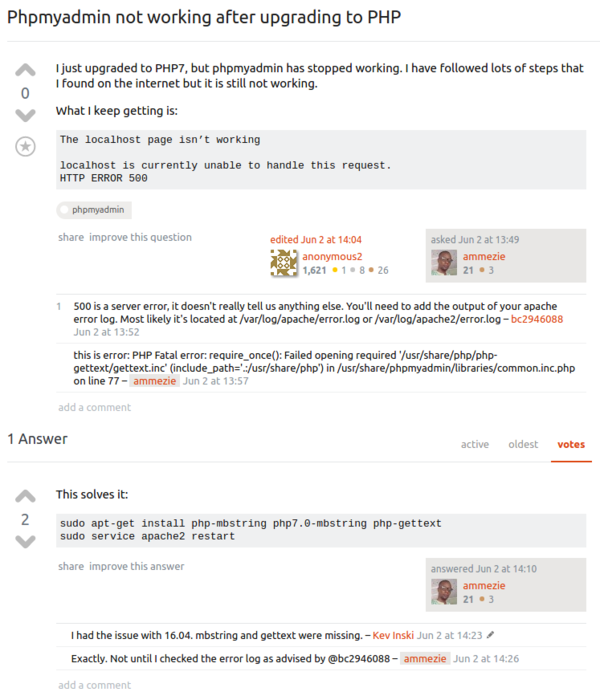

* Based on this tutorial, [http://www.allaboutlinux.eu/how-to-run-php-on-ubuntu/](http://www.allaboutlinux.eu/how-to-run-php-on-ubuntu/).
* In Ubuntu in order for the Apache2 server to work with PHP `libapache2-mod-php5` need also to be installed.
* `libapache2-mod-php5` is something like a glue within the Apache2 server and your PHP files.
* However in Ubuntu 16.04 PHP5 is no longer supported, since it is using PHP7. Read this discussion for more information, [http://askubuntu.com/questions/756879/cant-install-php5-on-ubuntu-16-04](http://askubuntu.com/questions/756879/cant-install-php5-on-ubuntu-16-04).
* So to install the "glue" use this command, `apt-get install libapache2-mod-php`.
* From this web page, [http://askubuntu.com/questions/780897/phpmyadmin-not-working-after-upgrading-to-php](http://askubuntu.com/questions/780897/phpmyadmin-not-working-after-upgrading-to-php). There are also these pacakages those need to be installed in order for some PHP based static web site generator to works, `sudo apt-get install php-mbstring php7.0-mbstring php-gettext`.
* So to install LAMP Stack this is the updated command codes for the Ubuntu 16.04.

```markdown
sudo apt-get install apache2 libapache2-mod-php mysql-server php php-gettext php-mbstring php7.0-mbstring
sudo /etc/init.d/apache2 restart
php -r 'echo "\n\nYour PHP installation is working fine.\n\n\n";
```

* This are the full screenshots.





