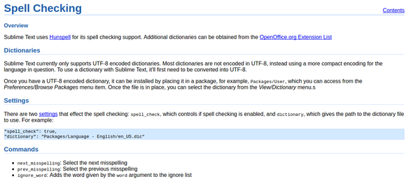

* Here is the link to the article, [https://www.sublimetext.com/docs/2/spell_checking.html](https://www.sublimetext.com/docs/2/spell_checking.html).
* Here is the setting codes.

```markdown
"spell_check": true,
"dictionary": "Packages/Language - English/en_US.dic"
```

* Additionally spell check can be activate by pressing F6 button.
* Here is the screenshot.

