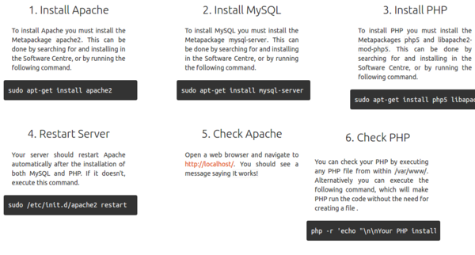

* Here a webpage on how to install LAMP Stack manually in Ubuntu, [http://howtoubuntu.org/how-to-install-lamp-on-ubuntu](http://howtoubuntu.org/how-to-install-lamp-on-ubuntu).
* I feel like the LAMP Stack that is provided from BitNami is harder to use because I do not know to which folder I should put my server file in.
* List of commands.

```markdown
sudo apt-get install apache2
sudo apt-get install mysql-server
sudo apt-get install php5 libapache2-mod-php5
sudo /etc/init.d/apache2 restart
php -r 'echo "\n\nYour PHP installation is working fine.\n\n\n";'
```

* However in the latest LTS Ubuntu (16.04), the `sudo apt-get install php5 libapache2-mod-php5` is not working. So I replaced it with these commands.

```markdown
sudo apt-get install apache2
sudo apt-get install mysql-server
sudo apt-get install php
sudo /etc/init.d/apache2 restart
php -r 'echo "\n\nYour PHP installation is working fine.\n\n\n";'
```

* Here is the full screenshot of the web page.

